# Manual de usuario

## Inicio
Inicio componse da información relativa as tarefas que son para hoxe, as tarefas que estan retrasadas en base ao seu estado e fecha. Ademais, informache das tarefas que tes proximas.

O primeiro bloque contén as tarefas que son para hoxe e non están completadas, o segundo bloque contén todas aquelas tarefas que non están completadas e a sua data de vencemento é anterior a hoxe, o terceiro bloque contén as tarefas que non están completadas e a sua data de vencemento é posterior a hoxe.

Se algunha sección ten máis de 3 tarefas, mostrarase un botón que permitirá visualizar o listado de todas as tarefas da esa sección [ver todas as tarefas de unha sección](./manual_usuario.md#ver-mas-tarefas-de-unha-sección)

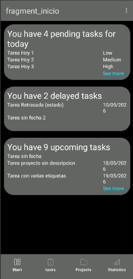

## Ver mais tarefas de unha sección

Esta opción so esta habilitada si en incio existe unha sección con mais de 3 tarefas, ao pulsar o botón mostrase un listado con todas as tarefas da sección.

Existe un checkbox para poder marcarla como completada o que automáticamente a elimina da sección.

Existe tamén un filtro de busqueda para poder filtrar polo titulo, descripción ou nome das etiquetas das tarefas.

Se clickas nunha tarefa levache aos detalles da tarefa onde podes ver toda a información da tarefa, editarla ou eliminala.

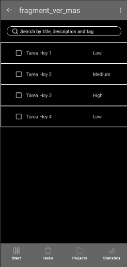

## Listar tarefas

Esta vista permite ver todas as tarefas que existen na aplicación creadas.

Dispón de un checkbox para marcar a tarefa como completada ou devolvela a un estado de en tempo ou retrasada.

Dispon de un filtro de busqueda avanzado que permite buscar polo titulo, descripción, nome das etiquetas ademais pola prioridad, estado e ordenalas pola fecha de creación ou data de vencemento.

Se clickas nunha tarefa levache aos detalles da tarefa onde podes ver toda a información da tarefa, editarla ou eliminala.

Dispon de un botón para crear unha nova tarefa que levara a unha nova vista onde se poden introducir os datos da tarefa a crear.

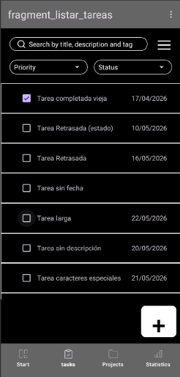

## Detalles da tarefa

Nesta vista podes ver toda a información da tarefa, editala ou eliminala.

Cando se clicke en eliminar aparecerá un modal de confirmación para evitar eliminacións accidentais.

Cando se clicke en editar levarache a unha nova vista cos campos editables da tarefa.

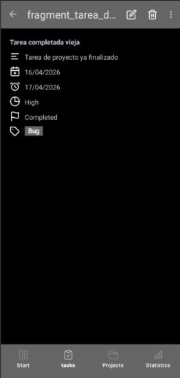

## Eliminar una tarefa

Modal que aparece ao clicar en eliminar una tarefa, para evitar eliminacións accidentais.

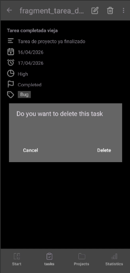

## Crear/Editar una tarefa

Vista que aparece ao clicar en editar una tarefa, con os campos editables da tarefa.

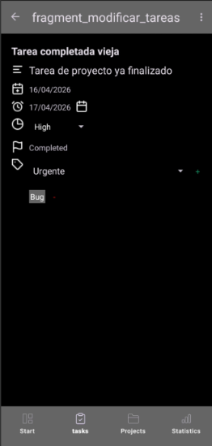

Modal que apare ao clickar en retroceder (flecha) para confirmar, descartar ou continuar editando a tarefa.

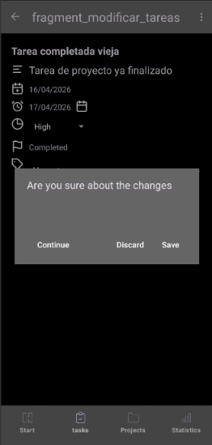

## Listar proyectos

Esta vista permite ver todas os proxectos que existen na aplicación creadas.

Dispon de un filtro de busqueda avanzado que permite buscar polo titulo, descripción, nome das etiquetas dun proxecto. Ademais, podes filtrar pola fecha de inicio ou data de fin do proxecto.

Se clickas nunha proxecto levache aos detalles da proxecto onde podes ver toda a información do proxecto, editalo ou eliminalo.

Dispon de un botón para crear unha nova tarefa que levara a unha nova vista onde se poden introducir os datos da tarefa a crear.

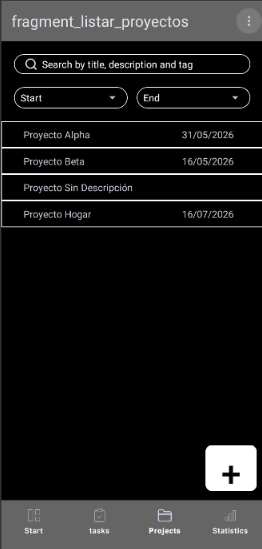

## Detalles do proxecto

Nesta vista podes ver toda a información do proxecto, editalo ou eliminalo.

Cando se clicke en eliminar aparecerá un modal de confirmación para evitar eliminacións accidentais.

Cando se clicke en editar levarache a unha nova vista cos campos editables do proxecto.

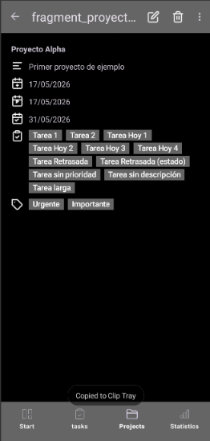

## Eliminar un proxecto

Modal que aparece ao clicar en eliminar un proxecto, para evitar eliminacións accidentais.

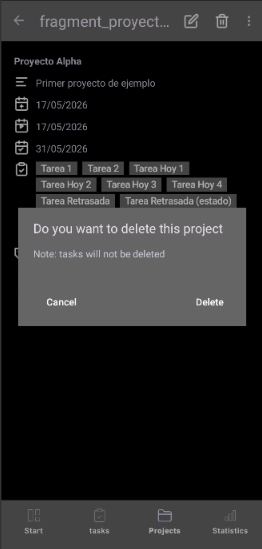

## Crear/Editar un proxecto

Vista que aparece ao clicar en editar un proxecto, con os campos editables do proxecto.

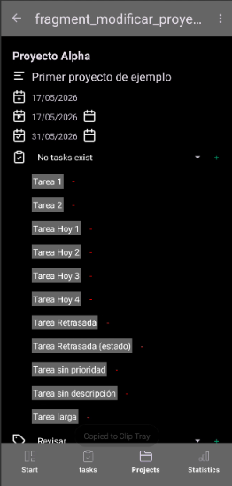

Modal que apare ao clickar en retroceder (flecha) para confirmar, descartar ou continuar editando o proxecto.

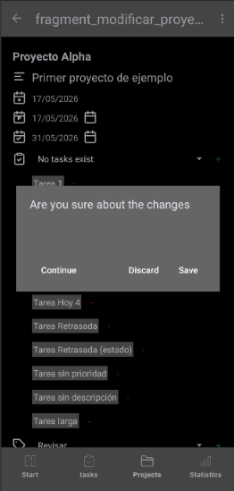

## Estadísticas

A primeira sección posue un gráfico en formato circular que mostra a realción de tarefas non completadas e completadas, ademais de mostrar o porcentaxe de tarefas completadas. (na actual semana)

A segunda sección posue 3 datos que mostran o número total de tarefas completadas, pendientes e retrasadas. (en todo o tempo)

A terceira secciòn posue un gráfico de barras que mostra a información sobre as tarefas do primer gráfico segregadas por día, mostrando o número de tarefas completadas e non completadas cada día. (na actual semana)

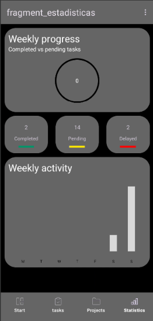

## Axustes

Nesta sección podes configurar o idioma da aplicación e o tema (claro ou escuro)

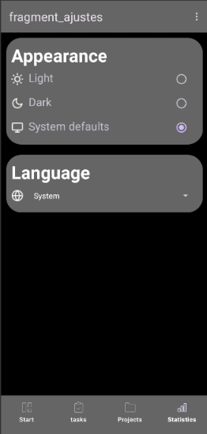

## Limpiar tarefas completadas

Esta opción permite eliminar todas as tarefas que están marcadas como completadas, para evitar acumular tarefas que xa non son necesarias.

Esto ten unha repercusión nas estadisticas, xa que internamente non habrá tarefas completadas e so quedaran as que no estan marcadas como completadas.

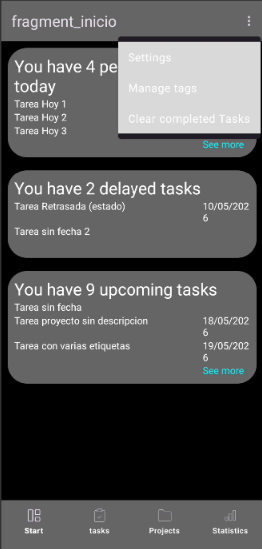

## Listar Etiquetas

Esta vista permite ver todas as etiquetas que existen na aplicación creadas.

Se clickas nunha etiqueta levache aos detalles da etiqueta onde podes ver toda a información da etiqueta, editala ou eliminala.

Dispon de un botón para crear unha nova etiqueta que levara a unha nova vista onde se poden introducir os datos da etiqueta a crear.

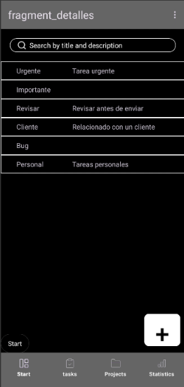

## Detalles da etiqueta

Nesta vista podes ver toda a información da etiqueta, editala ou eliminala.

Cando se clicke en eliminar aparecerá un modal de confirmación para evitar eliminacións accidentais.

Cando se clicke en editar levarache a unha nova vista cos campos editables da etiqueta.

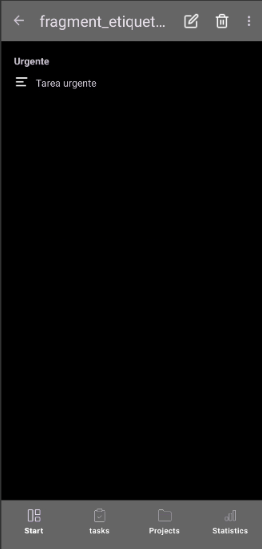

## Eliminar una etiqueta

Modal que aparece ao clicar en eliminar una etiqueta, para evitar eliminacións accidentais.

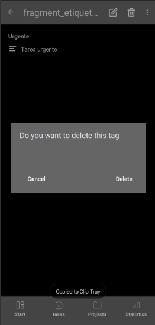

## Crear/Editar una etiqueta

Vista que aparece ao clicar en editar unha etiqueta, con os campos editables da etiqueta.

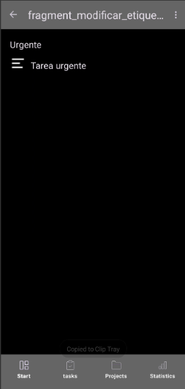

Modal que apare ao clickar en retroceder (flecha) para confirmar, descartar ou continuar editando a etiqueta.

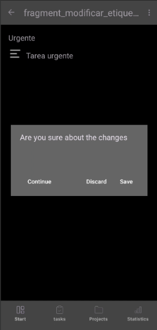