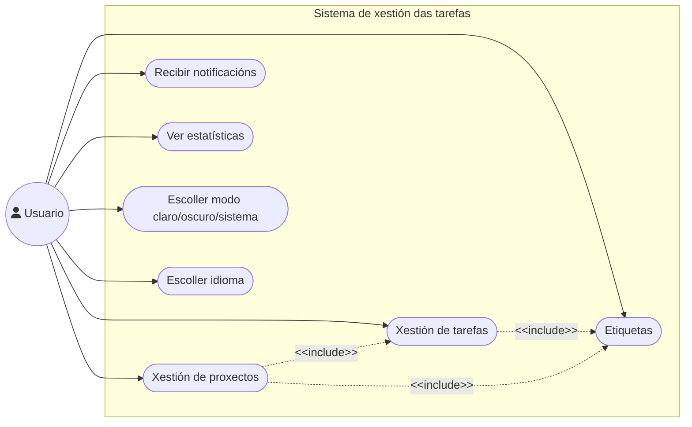

# Análise: Requirimentos do sistema

## Descrición xeral

## Casos de uso

## Funcionalidades

### FUNCIONAIS

- Crear, modificar e eliminar tarefas
- Crear, modificar e eliminar proxectos.
- Administrar etiquetas. [Etiquetas PoC](https://drive.google.com/file/d/1sLHvg22oigaUGgdMy45UHzQUbfJ7E8gH/view?usp=drive_link)
- Posibilidade de marcar tarefas como completas, establecer a súa prioridade e data de vencemento
- Sistema de notificacións para avisar se unha tarefa está retrasada ou se está próxima á data de vencemento
- Sistema de estatísticas con información sobre as tarefas da semana actual
- Filtrado de tarefas por distintos criterios como nome, prioridade, etiquetas, descrición...
- Filtrado de proxectos por nome e etiquetas
- Filtrado de etiquetas por nome e descrición
- O usuario poderá escoller entre modo claro, escuro ou modo do sistema
- O usuario poderá escoller entre varios idiomas dispoñibles ou deixar o idioma predeterminado do sistema

### NON FUNCIONAIS

- A aplicación preguntará se queres gardar, modificar ou eliminar unha tarefa, proxecto ou etiqueta e avisará se xurde algun problema ao facelo. [Etiquetas PoC](https://drive.google.com/file/d/1sLHvg22oigaUGgdMy45UHzQUbfJ7E8gH/view?usp=drive_link)

- As notificacións serán enviadas aínda que a aplicación estea pechada.

- Aínda que a aplicación se caese ou o dispositivo se apague, os datos gardados non verán afectados.

- As cores deben ofrecer unha experiencia de usuario agradable en ambos modos.

- A aplicación dispoñerá de varios idiomas.

## Tipos de usuarios

- Usuario: pode crear, modificar e eliminar tarefas, organizalas en proxectos, asignar etiquetas, marcar tarefas como completas e establecer a súa prioridade...

## Normativa

### Aviso legal

A aplicación de xestión de tarefas é unha ferramenta de software que permite ao usuario crear, editar, organizar e eliminar tarefas de forma local no seu dispositivo Android.

Esta aplicación non require rexistro de usuario; os datos creados polo usuario (tarefas, proxectos, etiquetas, etc.) almacénanse no dispositivo e non se comparten con terceiros.

### Política de privacidade

#### Responsable do tratamento

O responsável do tratamento é a persoa que usa o dispositivo xa que os datos non se comparten con terceiros nin se almacenan en servidores externos.

#### Finalidades do tratamento

Os datos recollidos pola aplicación utilízanse exclusivamente para:

- Permitir a creación, edición e xestión de tarefas e proxectos.
- Manter o estado das tarefas.
- Proporcionar funcións de notificación e recordatorios.
- Xeración de estatísticas locais sobre o uso e evolución das tarefas.

#### Legitimación do tratamento

A base legal para o tratamento dos datos é o consentimento do usuario (art. 6.1.a) do RGPD) e/ou a execución dun contrato (art. 6.1.b) do RGPD) cando o usuario emprega a aplicación para xestionar as súas propias tarefas.

#### Conservación dos datos

Os datos almacenados permanecen de forma local no dispositivo mentres o usuario manteña a aplicación instalada. O usuario pode eliminar en calquera momento a aplicación e os datos asociados desde a configuración de Android ou desde as opcións da propia aplicación.

#### Dereitos das persoas usuarias

Os usuarios teñen dereito a:

- Acceder aos seus datos.
- Rectificar datos inexactos.
- Eliminar os seus datos (dereito de supresión).
- Limitar ou opoñerse ao tratamento.

Para exercer estes dereitos, o usuario debe iteractuar coa aplicación.

#### Transferencias internacionais de datos

Esta aplicación non realiza transferencia de datos a terceiros nin a servizos externos. Todos os datos permanecen no dispositivo do usuario.

### Política de cookies

A aplicación é unha aplicación nativa de Android e, por tanto, **non** utiliza cookies no sentido tradicional dos navegadores web. Non obstante, se no futuro a aplicación integra servizos externos (por exemplo, análises ou servizos en liña), esta política actualizarase para reflectir calquera uso de mecanismos de almacenamento similares (como identificadores de publicidade ou almacenamento local interno).

### Mecanismos para cumprir a normativa de protección de datos

- **Minimización de datos:** só se recollen os datos estritamente necesarios para a funcionalidade da aplicación.
- **Anonimato e localidade:** non se recollen datos persoais identificables (como nome, correo, enderezo, etc.) nin se require inicio de sesión.
- **Transparencia:** a presente sección explica claramente quen é o responsable e para que se usan os datos.
- **Control do usuario:** o usuario ten control completo sobre os datos, podendo eliminar a aplicación e os datos locais en calquera momento, e exportar ou borrar as tarefas se a aplicación ofrece esas opcións.
- **Seguridade:** a base de datos local non e accesible a outras aplicacións, e a aplicación non comparte datos con terceiros.
