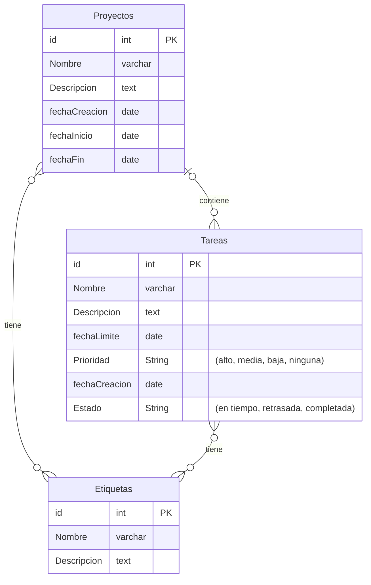

# Deseño

## Diagrama da arquitectura

## Diagrama de Base de Datos

```mermaid
erDiagram
    %% tablas
    Tareas {
        id int PK
        Nombre varchar
        Descripcion text
        fechaLimite date
        Prioridad String "(alto, media, baja, ninguna)"
        fechaCreacion date
        Estado String "(en tiempo, retrasada, completada)"

    }
    Proyectos {
        id int PK
        Nombre varchar
        Descripcion text
        fechaCreacion date
        fechaInicio date
        fechaFin date
    }
    Etiquetas {
        id int PK
        Nombre varchar
        Descripcion text
    }

    %% relaciones
    Proyectos o|--o{ Tareas : contiene
    Proyectos o{--o{ Etiquetas : tiene
    Tareas o{--o{ Etiquetas : tiene
```

## Deseño de interface de usuarios
