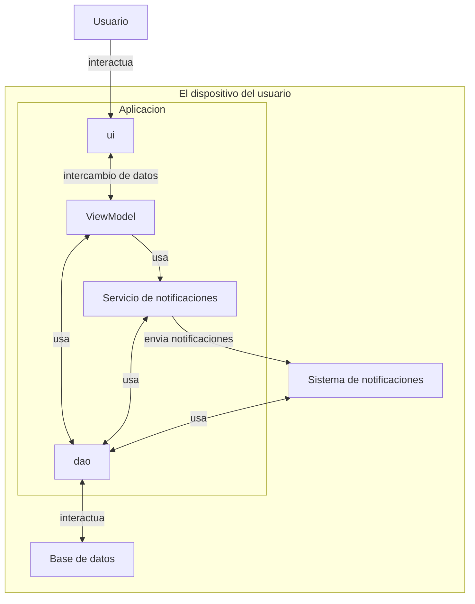
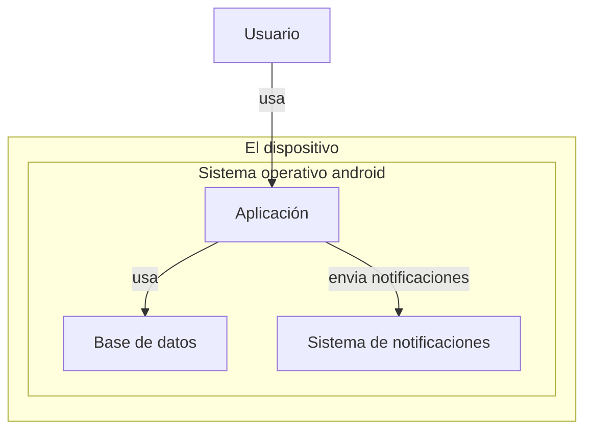
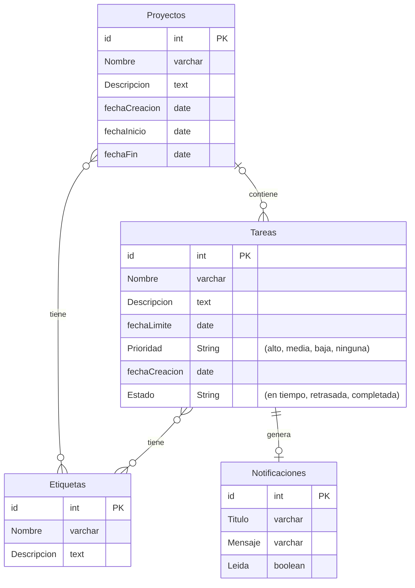
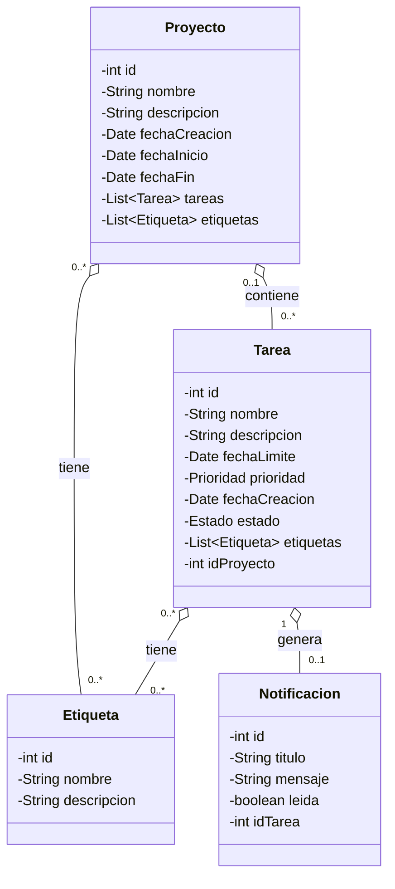

# Deseño

## Diagrama da arquitectura

### Diagrama de componentes

### Diagrama de Despliegue

## Diagrama de Base de Datos

## Diagrama de clases

## Deseño de interface de usuarios

[enlace a figma](https://www.figma.com/design/VZCQcw7a7B60PrGtjRBL0c/El-proyecto?node-id=0-1&p=f&t=KTdcYnHBGH3pHU1V-0)