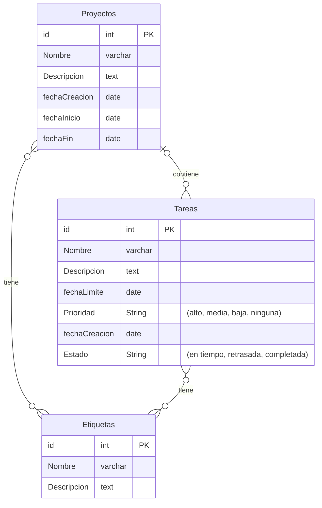
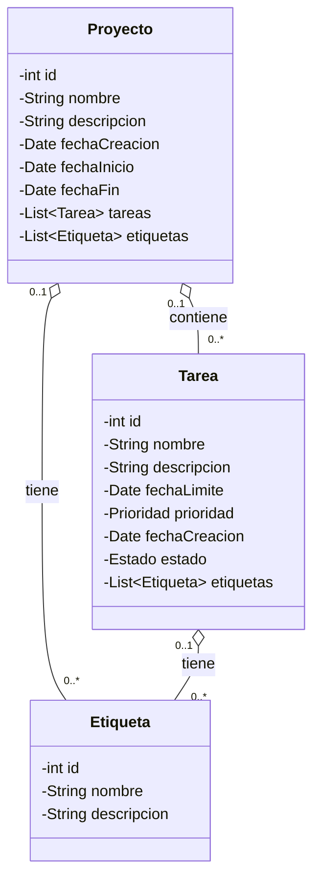

# Deseño

## Diagrama da arquitectura

## Diagrama de Base de Datos

```mermaid
erDiagram
    %% tablas
    Tareas {
        id int PK
        Nombre varchar
        Descripcion text
        fechaLimite date
        Prioridad String "(alto, media, baja, ninguna)"
        fechaCreacion date
        Estado String "(en tiempo, retrasada, completada)"

    }
    Proyectos {
        id int PK
        Nombre varchar
        Descripcion text
        fechaCreacion date
        fechaInicio date
        fechaFin date
    }
    Etiquetas {
        id int PK
        Nombre varchar
        Descripcion text
    }

    %% relaciones
    Proyectos o|--o{ Tareas : contiene
    Proyectos o{--o{ Etiquetas : tiene
    Tareas o{--o{ Etiquetas : tiene
```

## Diagrama de clases

```mermaid
classDiagram
    class Tarea {
        -int id
        -String nombre
        -String descripcion
        -Date fechaLimite
        -Prioridad prioridad
        -Date fechaCreacion
        -Estado estado
        -List~Etiqueta~ etiquetas
    }

    class Proyecto {
        -int id
        -String nombre
        -String descripcion
        -Date fechaCreacion
        -Date fechaInicio
        -Date fechaFin
        -List~Tarea~ tareas
        -List~Etiqueta~ etiquetas
    }

    class Etiqueta {
        -int id
        -String nombre
        -String descripcion
    }

    %% Relaciones
    Proyecto "0..1" o-- "0..*" Tarea : contiene
    Proyecto "0..1" o-- "0..*" Etiqueta : tiene
    Tarea "0..1" o-- "0..*" Etiqueta : tiene

```

## Deseño de interface de usuarios
